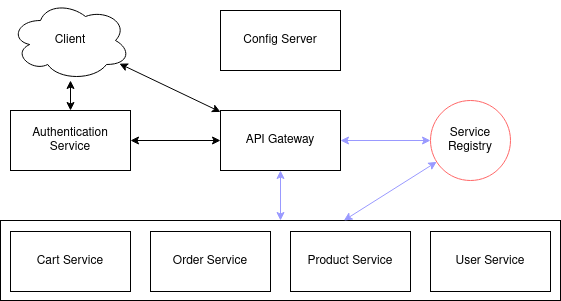
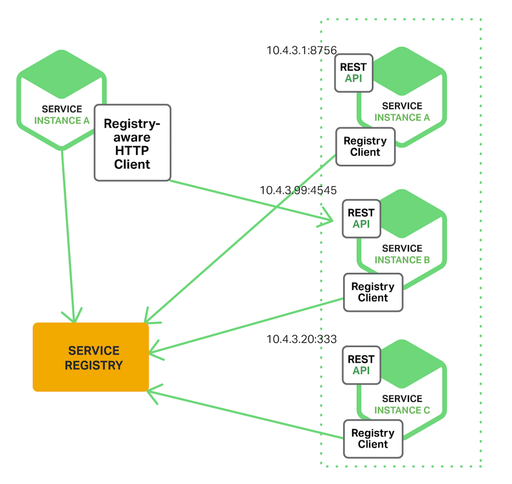
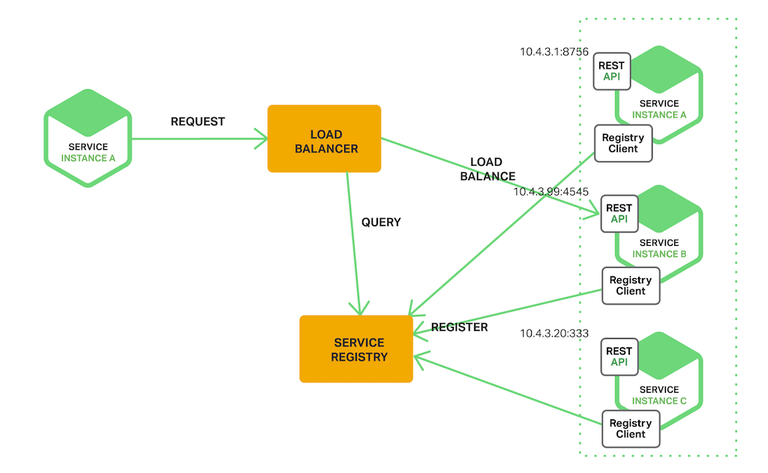
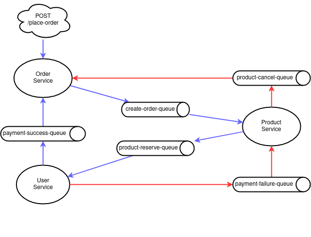

# micro-shop

Very simple shop application (backend only) for getting started with microservice architecture concept

## Table of Contents

* [Requirements](#requirements)
* [Data-model](#data-model)
  * [User Service](#user-service)
  * [Product Service](#product-service)
  * [Cart Service](#cart-service)
  * [Order Service](#order-service)
* [Architecture and Patterns](#architecture-and-patterns)
  * [Config Server](#config-server)
  * [Authentication](#authentication)
  * [API Gateway](#api-gateway)
  * [Service Discovery](#service-discovery)
  * [REST](#rest)
  * [Saga](#saga)
* [Running Instructions](#running-instructions)
  * [Via maven (spring boot)](#via-maven-spring-boot)
  * [Via docker](#via-docker)

## Requirements

A web application with minimalist feature for customer to buy products:

- User registration with authentication (TODO)
- All registered users can search and buy products and see all orders they have done
- product CRUD managements
- Provide a Shopping Cart that can keep user selections even they go offline
- No online payment is supported yet. Customer is required to pay by their balance when check-out an order

## Data model

The application follows [Database per service](https://microservices.io/patterns/data/database-per-service.html) pattern. In this part, we discuss data schema and datastore considerations.

#### User Service

The User Service stores information about all of the customers which use the application. There is nothing much about storage requirements for the User Service, just store some personal information. However, user data is involved in almost transactions, so we need ensure the data consistency. Because of the familiar, I will use MySQL for this case.

**Table: users**

| Columns            |
| ------------------ |
| id                 |
| username           |
| password           |
| balance            |
| default_address_id |
| created_at         |

**Table: address**

| Columns |
| ------- |
| id      |
| user_id |
| address |

#### Product Service

The Product Service stores information about all of the products. The storage requirements for the Product  Service are:

- Long-term storage
- Data structure will becomes more complicated over time (Category, Brand, Attribute, ...)
- Heavy read query (the traffic from view, search, sort items are always much higher than the traffic from update items) with complex joins.

A relational database such as MySQL is appropriate in this case. For the simplicity, I just use only Product table without category or product's attribute:

**Table: products**

| name               |
| :----------------- |
| id (PK)            |
| name               |
| price              |
| remaining_quantity |

#### Cart Service

Cart Service stores information about shopping cart of the customers. The storage requirements for the Shopping Cart Service are:

- Short-term storage, based on user session. Each customer will have only one shopping cart at the moment. After customer checkout, the cart data will be cleared
- Support only 1 simple query: query by customer
- Need retrieve/lookup and update shopping cart data quickly

Because cart data need to have persistence, but don't need to be permanently stored, a flexible key-value store like Redis is a much better choice over a traditional relational database

| Key    | Value                                          |
| ------ | ---------------------------------------------- |
| userId | list of CartItem (product and placed quantity) |

#### Order Service

Order Service stores information about all of our customer orders. The storage requirements for the Order are:

- Long-term storage
- Able to handle a high volume of packages, requiring high write throughput (for example, there are some big sale, a lot of customers come to the application and make orders)
- Support simple queries, no complex joins 

In this case, a document-based database such as MongoDB is appropriate. Because the data structure is simple and MongoDB can achieve high write throughput and scale well in term of traffic or data size

**Document: orders**

| Column        |                                                    |
| ------------- | -------------------------------------------------- |
| id            |                                                    |
| user_id       |                                                    |
| order_details | embedded document contains a list of order details |
| order_status  | PENDING, FAILED, CONFIRMED, DELIVERING, COMPLETED  |
| remarks       |                                                    |

**Document: order_details**

| Column     |
| ---------- |
| product_id |
| quantity   |


## Architecture and Patterns



### Config Server

Following [12-factor app](https://12factor.net/config), configuration should be separated from code, and should be store in environment variables. In this example, I used [Spring Cloud Config](https://spring.io/projects/spring-cloud-config), which provides server and client-side support for externalized configuration in a distributed system. We can have a central place to manage external properties for applications across all environments and be easily switch between deployment stages.

### Authentication

// TODO

###  API Gateway

Using [Spring Cloud Gateway](https://spring.io/projects/spring-cloud-gateway) to implement an API gateway that is the single entry point for all clients. The API gateway handles requests in one of two ways. Some requests are simply proxied/routed to the appropriate service. It handles other requests by fanning out to multiple services.

### Service Discovery

Service Discovery is a pattern which allow a client can determine the location of a service instance to which to send requests. There are 2 patterns for service discovery: Client-side and Server-side discovery. Both two discovery patterns require a **Service Registry** in order to know the information of service instances.

1. **[Service Registry](https://microservices.io/patterns/service-registry.html)**: It is a database of services, their instances and their locations. A service registry needs to be highly available and always up to date. Service instances are registered with the service registry on startup and deregistered on shutdown. Client will query the service registry to find the available instances of a service. A service registry might invoke a service instance’s health check API to verify that it is able to handle requests.

2. **[Client-side service discovery](https://microservices.io/patterns/client-side-discovery.html)**: The client talks directly to the service registry and gets the complete address (host and port) of all instances of service to be called. The client then uses a load balancing algorithm to select one of the available service instances and makes a request. So, in the end, the client knows the host and port of service and the client is the one who makes a final request to targeted service.
   

Pros:

* Simple and straightforward. Except for the service registry, there are no other moving parts
* Because the client knows about the available services instances, it can make intelligent, application‑specific load‑balancing decisions

Cons:

* Couples the client to Service Registry
* Client-side service discovery logic has to be implemented for each programming language/frameworks used by the service clients

3. **[Server-side service discovery](https://microservices.io/patterns/server-side-discovery.html)**: The client talks to a Load Balancer (or router). Router internally discovers the address of service via Service registry and then make a call further to target service. 
   

Pros:

* Client code becomes simpler as it does not have to deal with service discovery and the programming language/frameworks
* Client never got to know about the target service details and addresses, just simply make requests to the load balancer.

Cons:

* Requires a load balancer by deployment environment. It is another highly available system component that need to setup and manage.

*In this project, I used spring-cloud-starter-netflix-eureka-server to start Eureka Server for service registration and client-side service discovery pattern because of its simplicity.*

### REST

I choose REST for inter-service communication. Client creates a REST call (GET, POST, PUT, DELETE, ...) to make requests to a service. There are many technologies similar to REST (gRPC, Apache Thrift), they are called [Remote Procedure Invocation](https://microservices.io/patterns/communication-style/rpi.html). Because of its stateless, REST request should not be used in a transactional boundary that spans in many services. **Therefore, REST is useful for requests which requires stateless or low-latency**.

In this project, I used [Spring Cloud OpenFeign](https://spring.io/projects/spring-cloud-openfeign), which creates an interface decorated REST Client with JAX-RS or Spring MVC annotations

### Saga

[Saga pattern](https://microservices.io/patterns/data/saga.html) is used for inter-service communication too. This is the preferred pattern to implement business transaction that spans multiple services.

A saga is a sequence of local transactions. Each local transaction updates the database and publishes a message or event to trigger the next local transaction in the saga. If a local transaction fails because it violates a business rule then the saga executes a series of compensating transactions that rollback the  changes that were made by the preceding local transactions.

Instead of Saga, there is another solution, [two-phase commit](https://en.wikipedia.org/wiki/Two-phase_commit_protocol). However, 2PC works as single commit, aims to perform ACID transactions on distributed systems. The main disadvantage of 2PC is "[blocking problem](https://en.wikipedia.org/wiki/Two-phase_commit_protocol#Disadvantages)" and it's hard to horizontal scale the number of service instances in case our application goes bigger.

In this project, I used RabbitMQ to implement choreography-based saga pattern to perform *place order* logic:



## Running Instructions

### Via maven (spring boot)

Make sure you have MySQL, MongoDB, Redis and RabbitMQ running on localhost (on default ports).

```bash
$ cd micro-shop/ConfigService
$ mvn spring-boot:run
```

```bash
$ cd micro-shop/DiscoveryService
$ mvn spring-boot:run
```

```bash
$ cd micro-shop/GatewayConfig
$ mvn spring-boot:run
```

- Repeat this for all other services that you want to run. Please ensure that ConfigService, DiscoveryService, GatewayConfig must be started with the correct order before run the others.
- All services are run with `default` profile.

### Via docker
We will run with `docker` profile since docker enviroment is different from local enviroment.
```bash
$ cd eshop
$ mvn clean install
$ docker-compose profile=docker up --build -d
```
